# Homework 2
## Business administration, 1st year
## Prof.: lect. dr. Andrei Rusu
Solve at least 1 type of problem from the following blocks of problems: 

-----------------

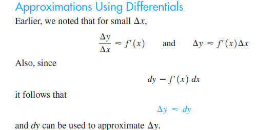

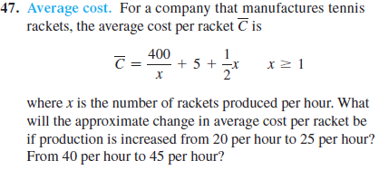

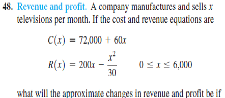

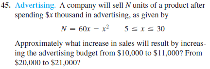

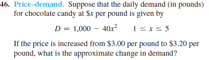

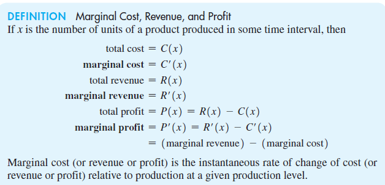

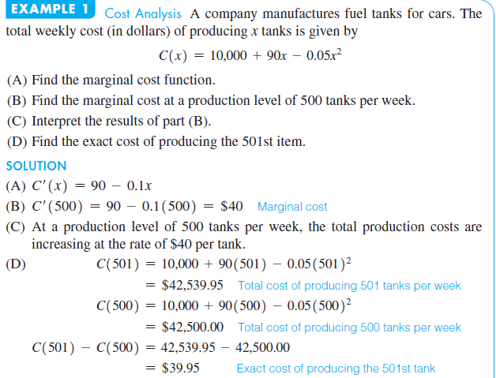

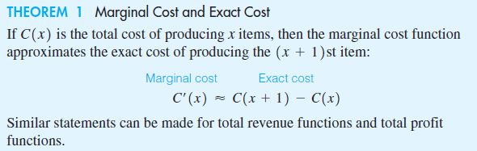

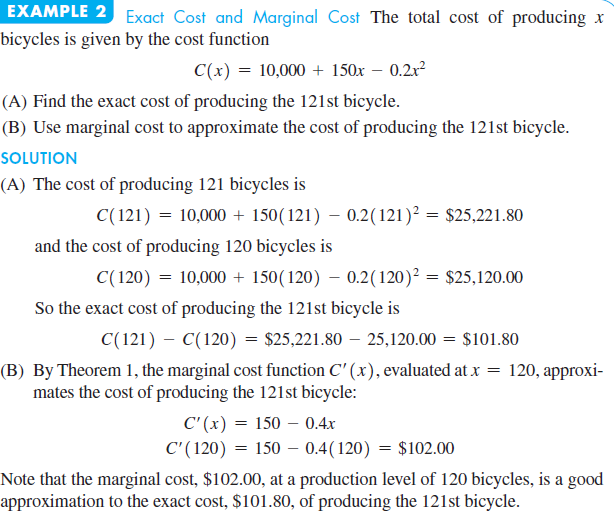

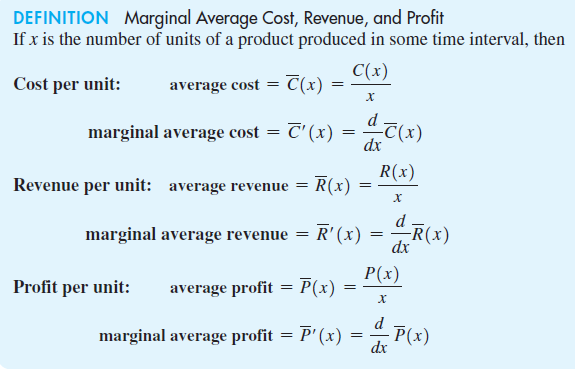

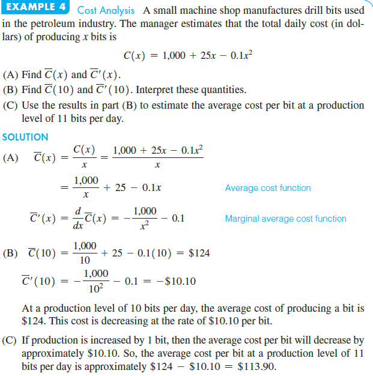

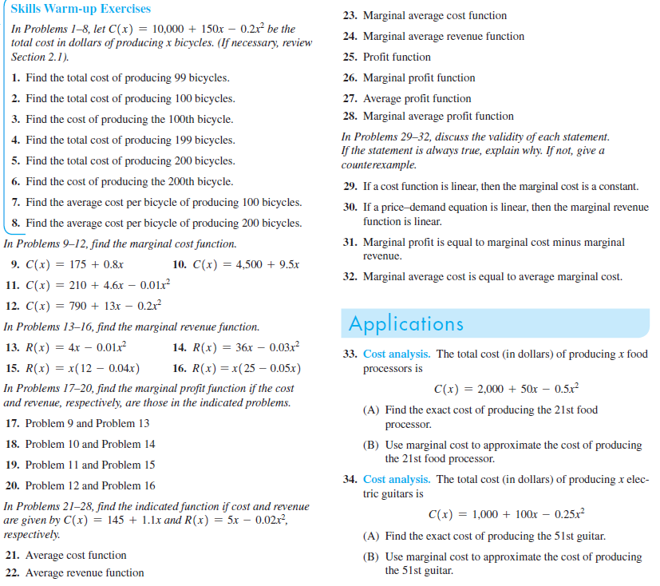

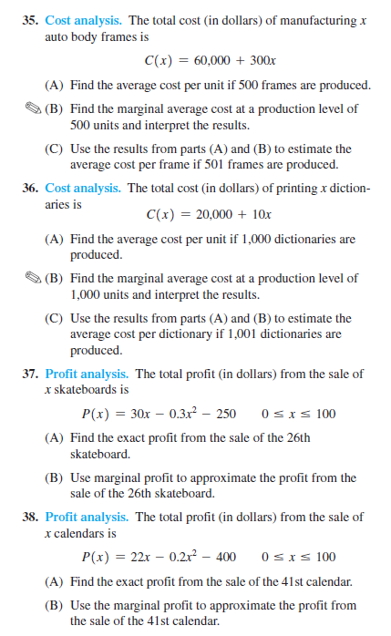

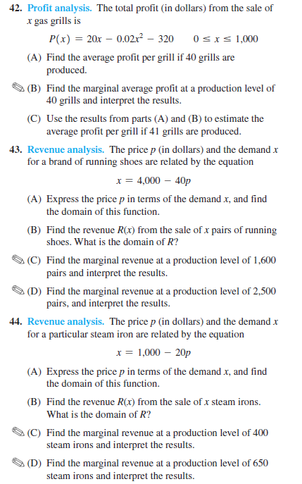

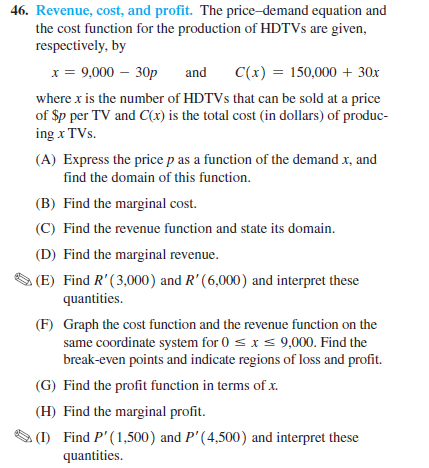

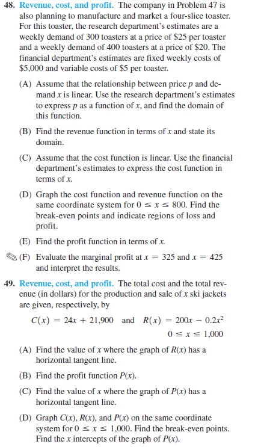

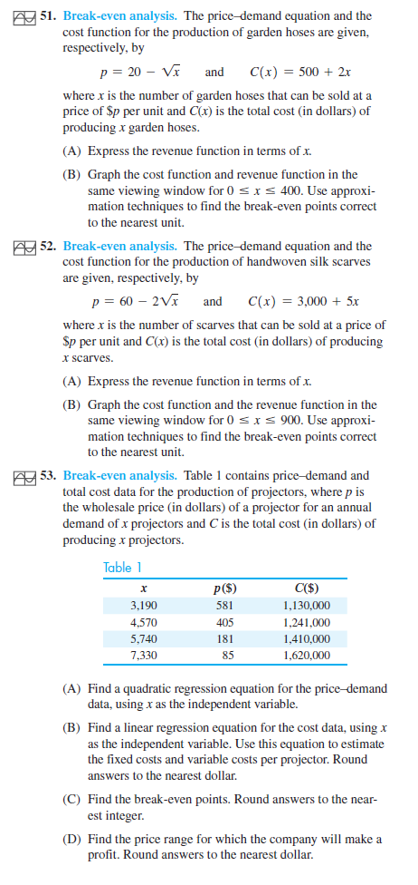

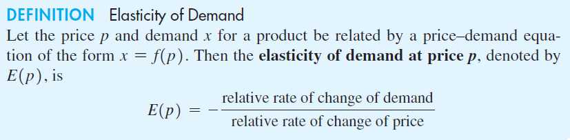

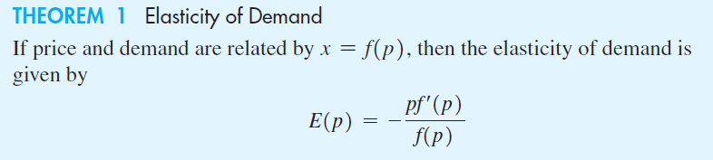

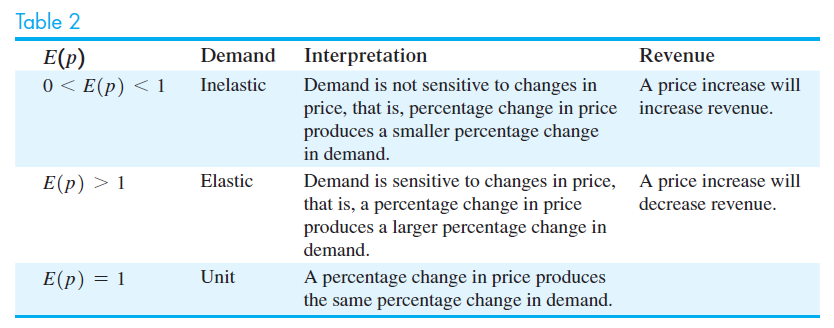

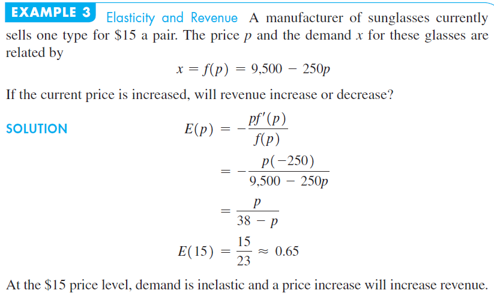

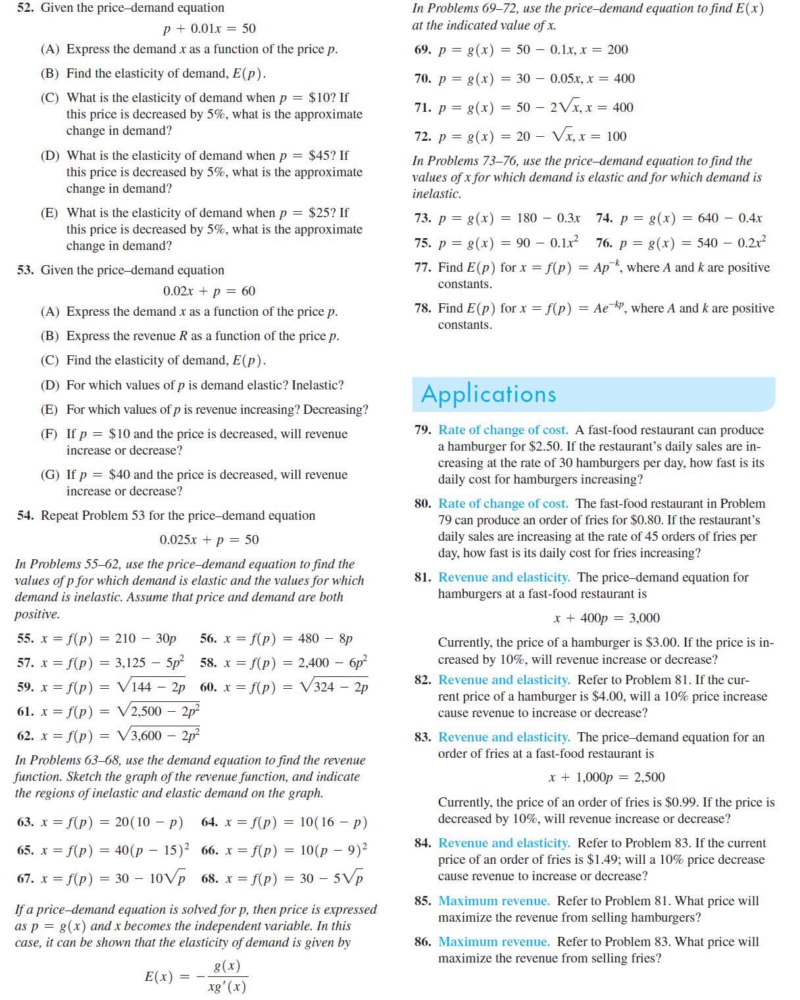

-----------------
